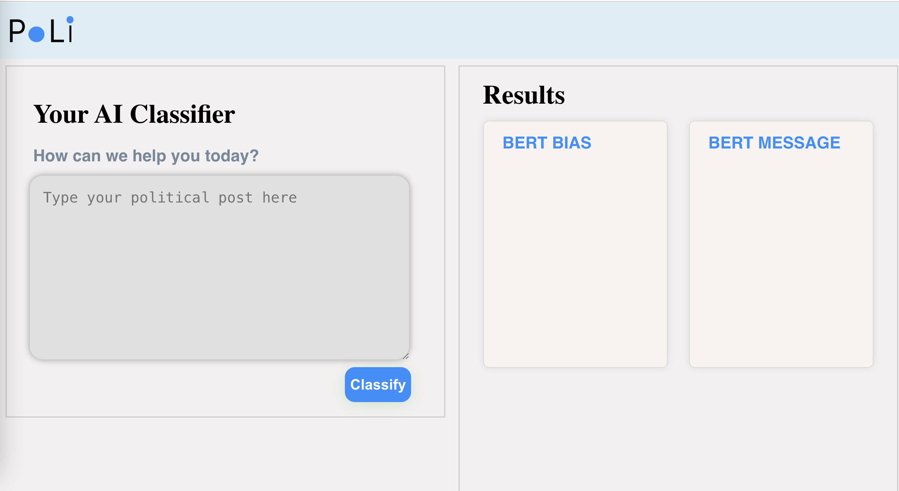

# Political Social Media Post AI Classifier with Natural Language Processing (NLP)  

## Project Overview  
This is a **group NLP project** (4 members) aiming to analyze and classify **political social media posts**.  
We applied **Natural Language Processing (NLP)** techniques to clean text data, trained and fine-tuned multiple deep learning models (GPT-2, BERT, LSTM), and finally built a **full-stack web application** to demonstrate model performance.

---
## Usage
Users can input any political social media post, not limited to the dataset used for training.
- The models were trained and fine-tuned on the 2015 Crowdflower Political Social Media Posts dataset.
- Once trained, the models can generalize to unseen political posts.
- When a user submits a post through the web application, the system applies the trained BERT (and other models) to classify:
  - **Bias** → Neutral vs. Partisan
  - **Message type** → Attack, Constituency, Information, Media, Mobilization, Personal, Policy, Support
---

## Dataset  
- **Source**: Kaggle [Crowdflower’s Data For Everyone Library – 2015 Political Social Media Posts](https://www.kaggle.com/datasets/crowdflower/political-social-media-posts)  
- Contains annotated U.S. political social media posts.  

---

## Classification Tasks  

1. **Bias Classification**  
   - Classes: `Neutral`, `Partisan`  

2. **Message Classification**  
   - Classes (8 total):  
     - `Attack`  
     - `Constituency`  
     - `Information`  
     - `Media`  
     - `Mobilization`  
     - `Personal`  
     - `Policy`  
     - `Support`  

---

## Models  
- **Data Preprocessing & Feature Extraction**: extraneous HTML characters removal, Regular expressions, TF-IDF, tokenization  
- **Models trained and fine-tuned**:  
  - **LSTM**  
  - **GPT-2**  
  - **BERT (best performance)**  
- The final application uses the **fine-tuned BERT model** for bias and message prediction for any policital posts.  

---

## System Architecture  
To demonstrate model performance, we developed a **full-stack web application**:  
- **Frontend**: React  
- **Backend**: Flask API server (Python)  
- **Model storage**: Best result BERT models are saved and loaded for inference  
- **Deployment**:  
  - Frontend hosted on **Vercel**  
  - Backend hosted on **Render**  

---
## My Contributions:
- **Data Processing**: Cleaned and preprocessed raw political text data using regular expressions and NLP techniques (removing URLs, emojis, HTML tags, and special characters)
- **Model Training**: Trained and fine-tuned the LSTM model
- **Frontend Development**: Implemented React-based user interface and API integration (logo design, colors, user input section and animation)
- **Partial Backend**: Developed Flask API endpoints and model loading logic (prepare and load models from google drive since the models are too large and google drive has no cost comparing to other platforms)
- **Deployment**: Deployed application with Heroku (backend) and Vercel (frontend)

---

> Sample Poli App Home Page

